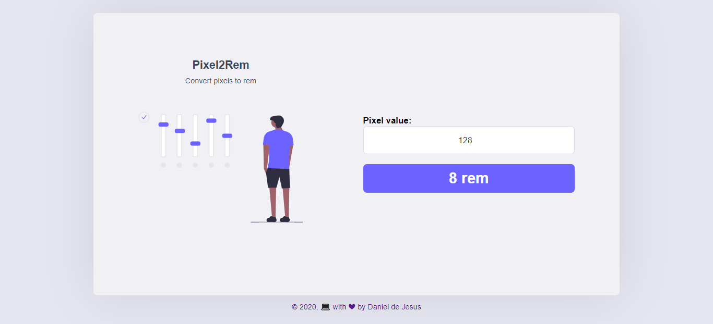

<h1 align="center">PixelConverter</h1>

 [](https://github.com/DanielJ06)
 [](#)

<p align="center">
   
</p>

📥 **Install dependencies**

```yarn install```

---

# 👨‍💻 Technologies
  -⚛️ [ReactJs](https://pt-br.reactjs.org/)
  
  -💙 [Typescript](https://www.typescriptlang.org/)
  
  -💅 [Styled-Components](https://styled-components.com/)
